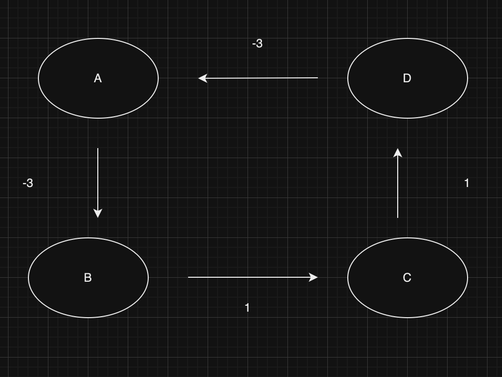
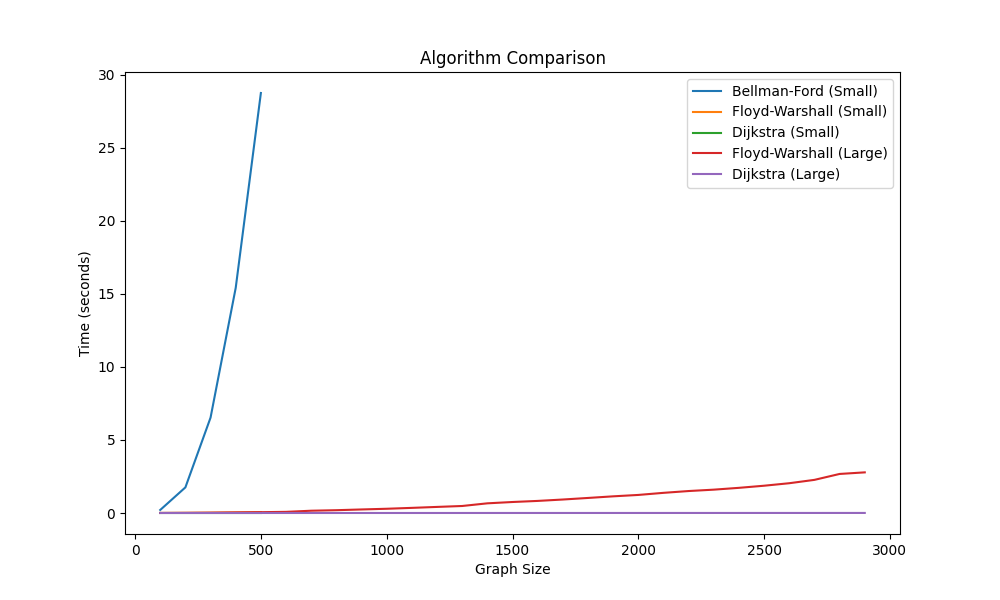
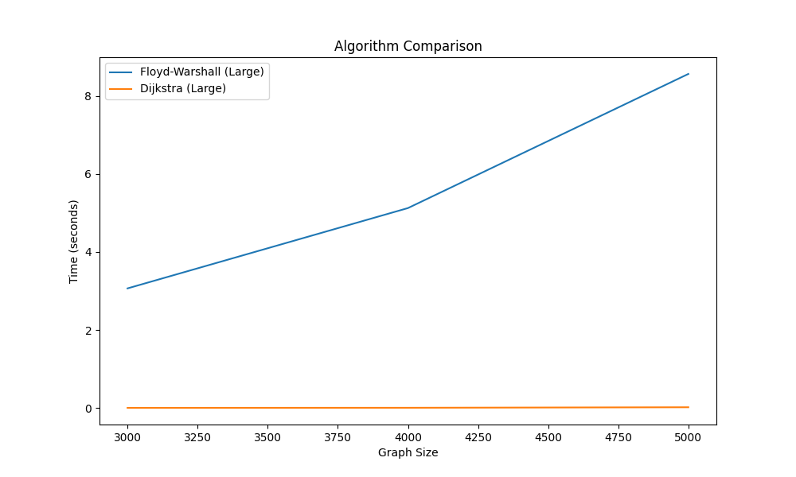
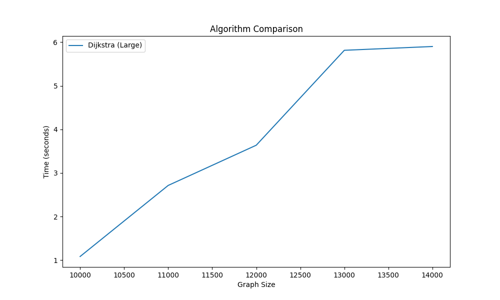

## Table of Contents
1. [What's inside](#What's inside)
2. [How to run it](#How to run it)
2. [Solution](#Solution)

## What's inside

`src` the source code  

`tests` tests for tools and algorithm 

`main.py` is the final answer to the task

## How to run it
A recommended python version: 3.7.9
```
python -m venv venv 
```
```
source venv/bin/activate 
```
```
pip install -r requirements.txt
```
```
python main.py
```

## Solution
### What is an Arbitrage ?


In the context of a market it refers to taking advantage of price differences between markets of the same asset. The
goal is to make a risk-free profit. When it comes to the market being efficient, prices quickly adjust to the new
information. Arbitrage occasion are very short-lived. Sometimes the information update lag is significantly bigger than
regular one and that's what we call an Arbitrage opportunity.

### Arbitrage Example

With given rates

```
1 USD = 0.85 EUR
1 EUR = 120 JPY
1 USD = 100 JPY
```

We can exchange EUR -> JPY in two ways:

```
1 USD -> EUR = 0.85 EUR
0.85 EUR -> JPY = 102 JPY

1 USD -> JPY = 100 JPY
```
That's our risk-free Arbitrage opportunity.

### Arbitrage as a Graph Algorithmic problem.

While traversing the graph each step has a cost. If we end up with a negative cost, it means we've earned.  
That case is called negative cycle and here is an example of it.

```
B -> C -> D -> A -> B 

     1    2   -1   -4
```
We can keep doing it on a repeat and take the profit.



When it comes to the currency exchange, we deal with multiplication instead of addition. 
To use graph algorithm to our problem we need to adjust the weights of each edge.
A very handy workaround exists for this problem. 
We need to change the inequality using the logarithm

```
c1 * c2 * … * cn > 1 | log
```
Then multiply by (-1) to change the direction
```
log(c1) + log(c2) + … + log(cn) > 0 | * (-1)
```
Extract (-1) out of braces
```
(-log(c1)) + (-log(c2)) + … + (-log(cn)) < 0
```

### Bellman Ford, Dijkstra and Floyd Warshall

I took under the investigation three popular algorithms to find the shortest path in a graph,
customize it to look for negative cycles and test their performance at a bigger scale.

1. Bellman Ford

   Pros:
    1. Handles Negative Weights -> This is no more a problem
    2. Detects Negative Cycles -> That's what we are looking for

   Cons:
    1. Time Complexity: O(V*E) -> This is a killer because input matrix is full dense
    2. Memory usage -> Each iteration needs to keep track of the vertex distances

2. Dijkstra

   Pros:
    1. Efficiency: O(V*logV+E)

   Cons:
    1. Cannot Handle Negative Weights -> Algorithm needs to be modified
    2. Requires a priority queue -> Aditional complexity

3. Floyd Warshall

   Pros:
    1. All-Pairs Shortest Paths -> Find the shortest path between all paris which can be more efficient then previous
       goin from each vertes to all other vertices.

   Cons:
    1. Time Complexity -> O(V^3)
    2. Space Complexity -> O(V^2) additional memory to store the distance matrix

### Performance test



```
Bellman Ford

Full dense of input matrix is a killer for this algorithm.
The time grows very quickly with the scale
```


```
Floyd Warshall


Very good choice when it comes to dense graphs this is because its complexity depends only on the number of vertices. 
But at 5k Currencies it started to take more than 8 seconds.
```



```
Dijkstra

Dijkstra's algorithm processes each edge at most once (when removing a vertex from the priority queue and relaxing its outgoing edges). 
Bellman-Ford, on the other hand, calculates each edge V times because of full dense matrix we get as an input.
Algorithm can finish as the shortest path is found, without needing to explore every other vertex.

But at 13k Currencies it started to take more than 5 seconds
```


### Summary 
It's pretty hard to create a good generator.
Mine is far away from perfect and even could be generating data perfectly design for Dijkstra. 
Even with that in mind, the ability to quick exit is a strong argument behind Dijkstra.
The final answer depends on a scale.
Bellman's is simple and was made to find negative cycle. It's a no-brainer to use with smaller scale.
According to the performance result, it makes no sense to use Floyd Warshall's algorithm instead of Dijkstra when the scale hits.


### What is CHSB ?
CHSB is a cryptographic financial ecosystem running blockchain's basic attributes: trust, transparency, accessibility, and fairness. 
The platform aims to be a cyber-wealth management platform for the users, and a community-centric approach.
The ecosystem involves Swarm Intelligence and Meritocracy that ensures the services are delivered according to the community's interests. 
The platform aims to create a decentralized, democratic, and professional network that can manage the portfolio of crypto assets.

### CHSB Key feature 

Beginner friendly

Free fiat deposits

Registered and regulated in many European countries

Competitive trading fees


